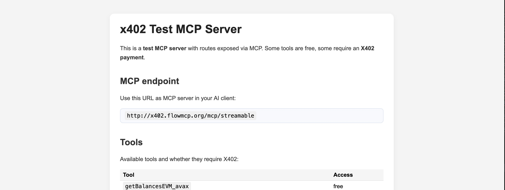
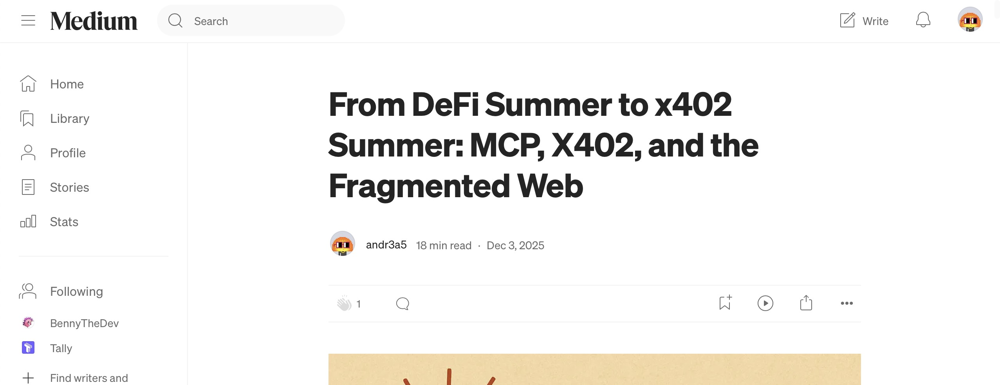
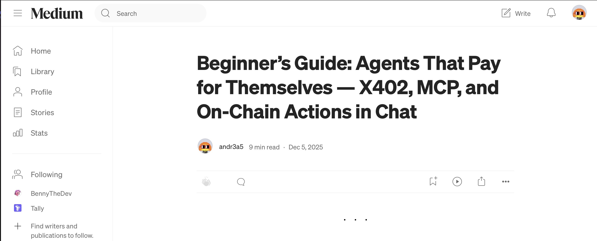
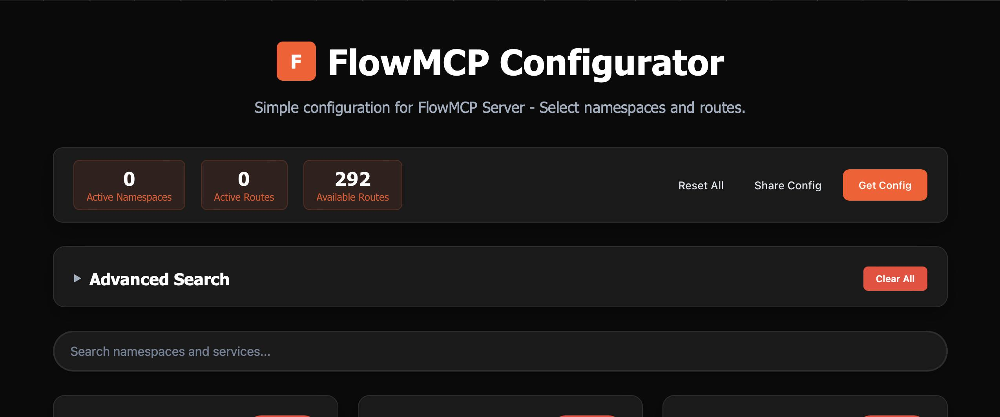

# via402 — Agent-Native Payments for MCP Tools


**via402** is a working system that shows how AI agents can pay for tools using **Model Context Protocol (MCP)** and **X402** — without requiring payment support from the AI client itself.

This repository documents the current state of that work and brings together over a year of experimentation across MCP infrastructure, agent workflows, and on-chain payments. The result is a fully functional demo, submitted to **Hack2Build: Payment Edition**.

---

## Try the demo

**Live demo**  
https://demo.via402.com

**Demo user**
```

Email:    [demo@via402.com](mailto:demo@via402.com)
Password: demo1234

```

The demo runs entirely on **Avalanche Fuji testnet**. Users can log in, call MCP tools, and trigger real on-chain test transactions.


---

## What via402 does

AI agents are good at calling tools. They are not good at paying for them.

Some MCP tools are free. Others require payment. Most AI clients intentionally avoid handling payments, which makes paid APIs inaccessible to autonomous agents. via402 removes that constraint.

An agent connects to via402 as if it were a normal MCP server. Behind the scenes, via402 forwards requests to one or more MCP services and handles **X402 payment flows** whenever a paid tool is invoked. From the agent’s perspective, free and paid tools behave the same.

No wallets. No client-side crypto. No special integration.

---

## Architecture (at a glance)



This monorepo contains two servers.

The **MCP Service Server** exposes MCP tools, including blockchain-related data services. Some tools are intentionally free, others require X402 payment.

The **via402 Proxy Server** is the only endpoint the agent or user talks to. It handles authentication for the demo, applies spending rules, signs X402 payments, and settles transactions on-chain. Requests are forwarded to MCP services and returned as standard MCP responses.

The key property is separation: agents stay simple, payments stay external.

---

## Why this matters

Hundreds of millions of users interact with AI systems every week. Many of those interactions already involve agents performing research, data retrieval, or multi-step workflows.

What these agents cannot do today is pay. They cannot autonomously unlock premium data, access paid APIs, or compensate service providers per request. This is not a blockchain limitation. It is an architectural one.

via402 decouples agent capability from client billing systems. Agents can access paid MCP tools without requiring the AI client to support payments at all.

---

## What emerged during Hack2Build

During Hack2Build, the focus shifted from building additional X402-enabled servers to understanding **why MCP payments are not used in practice**.

The key insight was simple: **the bottleneck is not the server side — it is the client side.** Most AI clients intentionally avoid payment logic. As long as no infrastructure exists between user and server to execute MCP payments, building more X402 payment servers alone does not unlock real usage.

via402 is the direct result of that conclusion. It introduces a client-independent payment layer between user and MCP servers, allowing agents to access paid tools without requiring any payment implementation in the AI client itself.

  
https://medium.com/@a6b8/from-defi-summer-to-x402-summer-mcp-x402-and-the-fragmented-web-94faa1c5ffb7

  
https://medium.com/@a6b8/beginners-guide-agents-that-pay-for-themselves-x402-mcp-and-on-chain-actions-in-chat-4439d7b7b52c

---

## Timeline and prior work

### April 2025 — FlowMCP



FlowMCP started as a framework to expose existing APIs as MCP servers using schema-based definitions. It evolved into a broader toolkit with hundreds of MCP-compatible routes, a schema library, and a visual configurator.

Repository: https://github.com/flowmcp  
Configurator: https://flowmcp.github.io/configurator/

---

### June 2025 — X402 and agent payments

Mid-2025 focused on making HTTP-native payments practical for agents.

x402-core: https://github.com/FlowMCP/x402-core  
x402 MCP middleware: https://github.com/FlowMCP/x402-mcp-middleware  
AgentPays: https://github.com/FlowMCP/agentPays  
ChainProbe: https://github.com/a6b8/chainprobe

---

### August 2025 — Hack2Build winner (Private Share)


Winner of **Hack2Build: Privacy Edition**.

The project explored how revenue can be shared fairly across many MCP services without exposing sensitive usage data, using zero-knowledge proofs for privacy-preserving accounting.

Core repo: https://github.com/FlowMCP/privateShare-core  
MCP middleware: https://github.com/FlowMCP/privateShare-mcp-middleware

---

### December 2025 — via402


via402 brings these threads together: MCP discovery, agent UX, X402 payments, and a live demo that can be used today.

---

## What comes next

The next steps are incremental and pragmatic.

The immediate goal is to remove the web login and allow authentication directly from the AI client. OAuth-based identity and permission delegation will follow.

On the payment side, the **Deferred X402 scheme** enables usage-based billing and batch settlement, which is especially relevant for research-heavy agent workflows.

Finally, via402 is designed to scale beyond a single MCP service. Discovering, analyzing, and connecting many independent X402-enabled MCP servers — including public registries — is a natural next step.

---

## Submission context

via402 is submitted to **Hack2Build: Payment Edition** as a working prototype. It runs exclusively on testnet, handles no real funds, and focuses on infrastructure rather than speculation.

The core question is simple:

**How can agents pay for what they use, without forcing every AI client to reinvent payments?**

